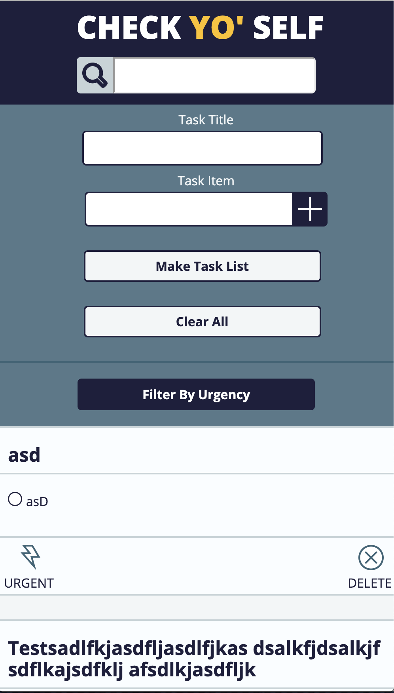

### Check Yo' Self Project Overview

## Overview:
Check Yo' Self is a web application that allows the user to add and manipulate personalized To Do Lists. These tasks are stored within local storage on the users PC, and will persist after the page is reloaded. Users can also check each task to denote that it has been completed, and sort cards that are Urgent. The user can also take advantage of a text search functionality to find 'To Do's' being displayed on the page.

## Technical Overview:
Check Yo' Self was built with HTML / CSS / and JavaScript. We leveraged classes to build and store each To Do List and task object within the page. 

## Overall Wins: 
I leveraged BEM principles to easily organize HTML/CSS. I was able to work with nested arrays of objects, and ensure they were represented properly on the DOM. 

## Overall Struggles:
I learned to be more wary of responsive styling. I had some struggles properly using media queries to ensure the page was consistent at all screen sizes. 

